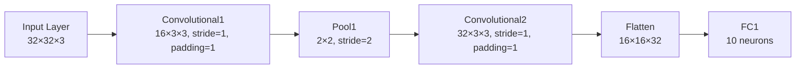

## Purpose

This article will go through the forward pass and backpropagation of a simple CNN. It will go through the math at every step and comput the derivations of the functions. 


## CNN Architecture



## Forward Pass

### 1. Input Layer:
From the diagram above, we can see that our input is `X ∈ ℝ³²×³²×³` (height x width x channels). 

---

### 2. Convolutional 1 layer (conv1):
This is defined by 16 kernels of shape 3x3 with a weight `W1` and bias `b1`. We can then write output after Convolutional 1 layer to be: 
```math
S^{[1]}_{c,i,j} = \sum_{c'=1}^{3}\sum_{u=0}^{2}\sum_{v=0}^{2} W^{[1]}_{c,c',u,v}\; X_{c',\,i+u-1,\,j+v-1} \;+\;b^{[1]}_{c}
```
where `c'` is the number of channels, `u` and `v` are the kernel sizes. 

We can see that this is just a weighted sum over each 3x3 patch in the input, plus a bias

---

### 3. ReLU Activation:

We then apply an element-wise ReLU activation function to clamp all negative values to zero and only keep positive values. The output denoted `A1` is: 
```math
   A^{[1]}_{c,i,j}
   = \max\bigl(0,\;S^{[1]}_{c,i,j}\bigr)
```

---

### 4. Max-Pooling Layer:

We will then reduce the resolution with 2x2 max-pooling which takes the maximum over each non-overlapping 2x2 block. This will reduce the dimensionality of the feature map. The output from this is denoted as `P1 ∈ ℝ16×16×16`: 
```math
   P^{[1]}_{c,p,q}
   = \max_{u,v\in\{0,1\}}
     A^{[1]}_{c,\,2p+u,\,2q+v}
```

---

### 5. Flattening:

We will then flatten the output from above into a vector `h`: 
```math
   h = \mathrm{flatten}\bigl(P^{[1]}\bigr),
   \quad
```
---

### 6. Fully Connected Layer:

We will now connect each output neuron to every neuron from the previous layer. The inputs in this step is `h1` and will be multiplied by a weight `W2` and added to a bias `b2`: 

```math
   z_i
   = \sum_{k=1}^{4096} W_{\mathrm{fc},\,i,k}\,h_k
   \;+\; b_{\mathrm{fc},\,i}
```
where `i = 1,....,10`

--- 

### 7. Softmax and Cross-Entropy Loss:

Finally, we will convert the output from above to probabilites using softmax `pi` and compute the loss `L`: 

```math
   p_i
   = \frac{e^{z_i}}{\sum_{j=1}^{10}e^{z_j}}
```
```math
   \mathcal L
   = -\sum_{i=1}^{10} y_i\,\log p_i
```
where `y` is the one-hot true label

## Backpropagation

We can now propagate the gradient from the lass function all the way back to the input layer by using the chain rule. 

From the above forward pass, we defined:
1. **Conv1** → pre-activation $\(S^{[1]}\)$
2. **ReLU1** → activation $\(A^{[1]}\)$
3. **MaxPool1** → $\(P^{[1]}\)$  
4. **Flatten** → vector $\(h\)$  
5. **FC1** → $\(z\)$  
6. **Softmax and Cross Entropy** → loss $\(\mathcal L\)$

We now compute $\(\delta^{[\cdot]} = \partial\mathcal L/\partial(\cdot)\)$ **in reverse**:

---

### 1. Softmax and Cross‐Entropy ⇒ FC1

From  
```math
   p_i
   = \frac{e^{z_i}}{\sum_{j=1}^{10}e^{z_j}}
```
```math
   \mathcal L
   = -\sum_{i=1}^{10} y_i\,\log p_i
```
we get this result
$$\{\delta^{[z]}_i
= \frac{\partial\mathcal L}{\partial z_i}
= p_i - y_i,
\quad i=1,\dots,10.
\}$$

---

### 2. Fully‐Connected (FC1) ⇒ flatten output \(h\)

The FC layer computes  
$$z_i = \sum_{k=1}^{4096}W_{\mathrm{fc},\,i,k}\,h_k + b_{\mathrm{fc},\,i}\$$
By the chain rule:

1. **Bias gradient**  
```math
   \delta^{[b_{\mathrm{fc}}]}_i
   = \frac{\partial\mathcal L}{\partial b_{\mathrm{fc},\,i}}
   = \delta^{[z]}_i
```
3. **Weight gradient**  
```math
   \delta^{[W_{\mathrm{fc}}]}_{i,k}
   = \frac{\partial\mathcal L}{\partial W_{\mathrm{fc},\,i,k}}
   = \delta^{[z]}_i \;\times\; h_k.
```
5. **Back-prop to \(h\)**  
```math
   \delta^{[h]}_k
   = \frac{\partial\mathcal L}{\partial h_k}
   = \sum_{i=1}^{10} W_{\mathrm{fc},\,i,k}\;\delta^{[z]}_i.
```
---

### 3. Flatten ⇒ pooled feature-map $$\(P^{[1]}\)$$

Reshape the vector $$\\delta^{[h]}\in\mathbb R^{4096}\$$ back into $$\delta^{[P^{1}]}\in\mathbb R^{16\times16\times16}\$$ by the inverse of $$k = c\cdot16\cdot16 + i\cdot16 + j\$$.

---

### 4. MaxPool ⇒ activation $\(A^{[1]}\)$

Max pooling routes gradients only to the max positions.  For each channel $$\(c\)$$ and block $$\((p,q)\)$$:

```math
\delta^{[A^{1}]}_{c,\,2p+u,\,2q+v}
=
\begin{cases}
\delta^{[P^{1}]}_{c,p,q},
&\text{if }(u,v)\text{ is the arg-max in that 2×2 window},\\
0,&\text{otherwise}.
\end{cases}
```

---

### 5. ReLU1 ⇒ pre-activation $\(S^{[1]}\)$

ReLU derivative is a mask:
```math
\boxed{\,
\delta^{[S^{1}]}_{c,i,j}
= \delta^{[A^{1}]}_{c,i,j}
\;\times\;
\mathbf{1}\bigl(S^{[1]}_{c,i,j}>0\bigr)
\;}
```

---

### 6. Conv1 ⇒ input $\(X\)$

Conv1 computes  
```math
S^{[1]}_{c,i,j}
= \sum_{c'=1}^{3}\sum_{u=0}^{2}\sum_{v=0}^{2}
  W^{[1]}_{c,c',u,v}\;
  X_{\,i+u-1,\,j+v-1,\,c'}
\;+\;b^{[1]}_{c}
```

By the chain rule:

1. **Bias gradient**  
```math
   \delta^{[b^{1}]}_{c}
   = \sum_{i,j}\delta^{[S^{1}]}_{c,i,j}
```

2. **Weight gradient**  
```math
   \delta^{[W^{1}]}_{c,c',u,v}
   = \sum_{i=1}^{32}\sum_{j=1}^{32}
     \delta^{[S^{1}]}_{c,i,j}
     \;\times\;
     X_{c',\,i+u-1,\,j+v-1}
```

3. **Back-prop to input**  
```math
   \delta^{[X]}_{c',x,y}
   = \sum_{c=1}^{16}\sum_{u=0}^{2}\sum_{v=0}^{2}
     W^{[1]}_{c,c',u,v}
     \;\times\;
     \delta^{[S^{1}]}_{c,\,x-u+1,\,y-v+1}
```

---
