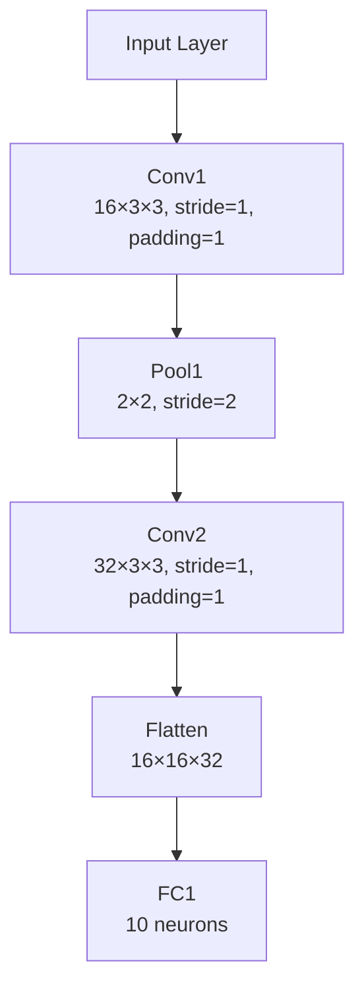

This article will go through the forward pass and backpropagation of a simple CNN. It will go through the math at every step and comput the derivations of the functions. 

Architecture of the CNN: 

## CNN Architecture

| Layer     | Type        | Hyperparameters                        | Output Shape       |
| --------- | ----------- | -------------------------------------- | ------------------ |
| **Input** | Input Layer | —                                      | 32 × 32 × 3        |
| **1**     | Conv1       | 16 filters, 3 × 3, stride=1, padding=1 | 32 × 32 × 16       |
| **2**     | MaxPool1    | 2 × 2 window, stride=2                 | 16 × 16 × 16       |
| **3**     | Conv2       | 32 filters, 3 × 3, stride=1, padding=1 | 16 × 16 × 32       |
| **4**     | Flatten     | —                                      | 16×16×32 → 8192    |
| **5**     | FC1         | 10 neurons                             | 10                 |
