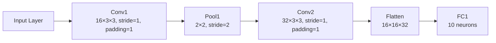

## Purpose
This article will go through the forward pass and backpropagation of a simple CNN. It will go through the math at every step and comput the derivations of the functions. 

## CNN Architecture

| Layer     | Type        | Hyperparameters                        | Output Shape       |
| --------- | ----------- | -------------------------------------- | ------------------ |
| **Input** | Input Layer | —                                      | 32 × 32 × 3        |
| **1**     | Conv1       | 16 filters, 3 × 3, stride=1, padding=1 | 32 × 32 × 16       |
| **2**     | MaxPool1    | 2 × 2 window, stride=2                 | 16 × 16 × 16       |
| **3**     | Conv2       | 32 filters, 3 × 3, stride=1, padding=1 | 16 × 16 × 32       |
| **4**     | Flatten     | —                                      | 16×16×32 → 8192    |
| **5**     | FC1         | 10 neurons                             | 10                 |

## Forward Pass

Let  
- **Input** tensor \(X\in\mathbb R^{3\times32\times32}\).  
- **Conv1** weights \(W^{[1]}\in\mathbb R^{16\times3\times3\times3}\), bias \(b^{[1]}\in\mathbb R^{16}\).  
- **Conv2** weights \(W^{[2]}\in\mathbb R^{32\times16\times3\times3}\), bias \(b^{[2]}\in\mathbb R^{32}\).  
- **FC1** weights \(W^{[\mathrm{fc}]}\in\mathbb R^{10\times8192}\), bias \(b^{[\mathrm{fc}]}\in\mathbb R^{10}\).  
- Padding \(p=1\), stride \(s=1\) for convolutions, pool window \(2\times2\), pool stride \(2\).

---

1. **Conv1** (output \(S^{[1]}\in\mathbb R^{16\times32\times32}\)):
   $$
   S^{[1]}_{c,i,j}
   = \sum_{c'=1}^{3}\sum_{u=0}^{2}\sum_{v=0}^{2}
     W^{[1]}_{c,c',u,v}\;
     X_{c',\,i+u-p,\,j+v-p}
   \;+\;b^{[1]}_{c}
   $$

2. **ReLU1** (output \(A^{[1]}\in\mathbb R^{16\times32\times32}\)):
   $$
   A^{[1]}_{c,i,j} = \max\bigl(0,\;S^{[1]}_{c,i,j}\bigr)
   $$

3. **MaxPool1** (output \(P^{[1]}\in\mathbb R^{16\times16\times16}\)):
   $$
   P^{[1]}_{c,p,q}
   = \max_{u,v\in\{0,1\}}
     A^{[1]}_{c,\;2p+u,\;2q+v}
   $$

4. **Conv2** (output \(S^{[2]}\in\mathbb R^{32\times16\times16}\)):
   $$
   S^{[2]}_{c,i,j}
   = \sum_{c'=1}^{16}\sum_{u=0}^{2}\sum_{v=0}^{2}
     W^{[2]}_{c,c',u,v}\;
     P^{[1]}_{c',\,i+u-p,\,j+v-p}
   \;+\;b^{[2]}_{c}
   $$

5. **ReLU2** (output \(A^{[2]}\in\mathbb R^{32\times16\times16}\)):
   $$
   A^{[2]}_{c,i,j} = \max\bigl(0,\;S^{[2]}_{c,i,j}\bigr)
   $$

6. **Flatten** (vector \(h\in\mathbb R^{8192}\)):  
   $$
   h = \mathrm{vec}\bigl(A^{[2]}\bigr)
   \quad\bigl(h_k = A^{[2]}_{c,i,j}\text{ for }k=c\cdot256+i\cdot16+j\bigr)
   $$

7. **Fully‐Connected** (logits \(z\in\mathbb R^{10}\)):  
   $$
   z_i = \sum_{k=1}^{8192}W^{[\mathrm{fc}]}_{i,k}\,h_k + b^{[\mathrm{fc}]}_{i}
   $$

8. **Soft‐max** (probabilities \(p\in\mathbb R^{10}\)):  
   $$
   p_i = \frac{\exp(z_i)}{\sum_{j=1}^{10}\exp(z_j)}
   $$

9. **Cross‐Entropy Loss** (scalar \(\mathcal L\)):  
   $$
   \mathcal L = -\sum_{i=1}^{10}y_i\,\log p_i,
   $$
   where \(y\in\{0,1\}^{10}\) is the one‐hot true label.