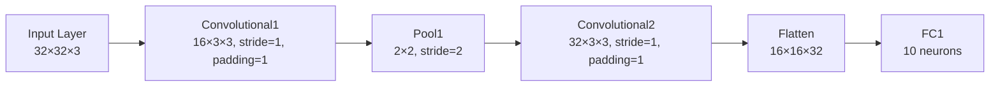

## Purpose

This article will go through the forward pass and backpropagation of a simple CNN. It will go through the math at every step and comput the derivations of the functions. 


## CNN Architecture



## Forward Pass

### 1. Input Layer:
From the diagram above, we can see that our input is `X ∈ ℝ³²×³²×³` (height x width x channels). 

---

### 2. Convolutional 1 layer (conv1):
This is defined by 16 kernels of shape 3x3 with a weight `W1` and bias `b1`. We can then write output after Convolutional 1 layer to be: 
```math
S^{[1]}_{c,i,j} = \sum_{c'=1}^{3}\sum_{u=0}^{2}\sum_{v=0}^{2} W^{[1]}_{c,c',u,v}\; X_{c',\,i+u-1,\,j+v-1} \;+\;b^{[1]}_{c}
```
We can see that this is just a weighted sum over each 3x3 patch in the input, plus a bias

---

### 3. ReLU Activation:

We then apply an element-wise ReLU activation function 
